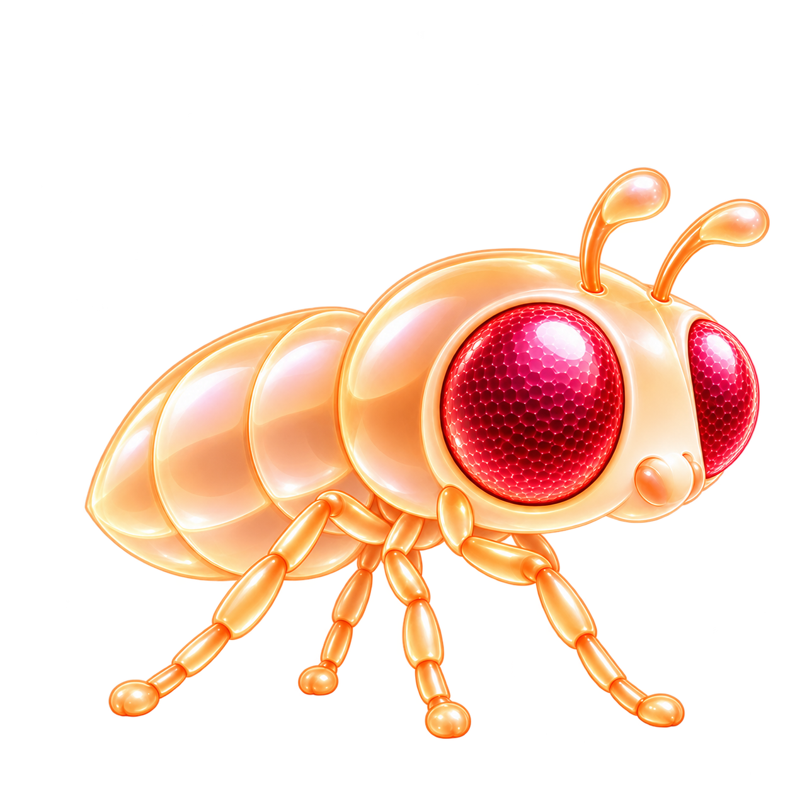

# IMMORTAL brand character and campaign art

**Current brand rule — owner confirmed, 2026-09-20.** The fruit-fly character shown on the **Colony NFT cards** (`/colony.html`) is the official IMMORTAL character style. Use it by default in X graphics, posters, ads, banners, launch art, and other promotional work that depicts a fly. A new request does not need to repeat this preference. The owner subsequently rejected the realistic matte/bristly v3 treatment and requested a cute, beautiful, polished game-collectible direction; the current v4 implementation follows that correction.

## Source of truth

**Homepage exception — owner confirmed, 2026-09-22.** Homepage fruit-fly illustrations use a futuristic holographic projection: translucent surfaces, luminous contours, delicate wing structure and schematic internal light paths. The owner explicitly requested this direction instead of the gemstone NFT-card finish on this surface. These projections are concept art, not genetic portraits or neural telemetry. Colony, token portraits and other promotional surfaces retain the default character rule below.

1. Inspect the current rendered Colony NFT cards, including their assembled wings. Their character design is the visual authority.
2. Use [`public/assets/colony-body-v4.png`](../public/assets/colony-body-v4.png) as the current body reference. It intentionally has **no wings**: the renderer adds them, along with deterministic colors and markings.
3. Follow [`src/life/colony-portrait.mjs`](../src/life/colony-portrait.mjs) and [COLONY-ART](COLONY-ART.en.md) for the complete portrait composition and supported phenotype variations. If the production asset is deliberately updated later, inspect that new Colony rendering rather than treating this filename as permanent.
4. Use [`src/brand.mjs`](../src/brand.mjs) for campaign colors.

This is a style reference, not a claim that all NFTs have the same body or eye color. Actual token portraits retain their seed-derived traits. A generic campaign mascot can use amber body and ruby eyes without claiming a particular token ID, rarity, or minted phenotype.

## Character traits to preserve

- Friendly, rounded collectible proportions: a large round head and compact, softly segmented abdomen.
- Two large domed compound eyes with jewel facets, a clear pearly catchlight and luminous depth; no human pupils or hollow honeycomb holes.
- Smooth, gently curved antennae with tiny rounded pearl tips and a small rounded face. Avoid sharp bristles, claws, feathered eyebrows and exposed mouthparts.
- Glossy candy-enamel material with soft pearly highlights and smooth pillowy segments. Amber/peach is the default campaign body treatment. Keep the finish luminous and stylized; avoid matte macro texture, pores, dense fur and harsh chrome reflections.
- Six fine articulated legs and one pair of translucent wings, attached at the upper thorax. Wing membranes have branching veins, a graceful fan silhouette and pearly reflections. Small and vestigial wings remain visibly reduced when depicting those genotypes.
- The same recognizable face, eye shapes, silhouette, material, and body proportions across an entire campaign.

Camera angle, pose, scene, lighting, and layout may vary while preserving the character. Scientific themes should place diagrams around or behind the intact character rather than replace its face with a realistic dissection or mechanical brain.

## Campaign palette

| Role | Color |
| --- | --- |
| Warm near-black canvas | `#0A0907` |
| Brand yellow | `#F0B90B` |
| Bone text | `#F0EAD9` |
| Ruby compound-eye accent | `#C23A32` |
| Filled CTA yellow | `#FCD535` |
| Text on yellow | `#0B0E11` |

Use yellow in backgrounds, type, and restrained lighting accents; it does not require a metallic yellow body. Existing phenotype colors remain valid for real specimen depictions. English campaign briefs use English both in captions and inside images unless the owner specifies another language. Brand colors alone do not imply a BNB or Binance endorsement.

## Required art workflow

1. Read this rule and visually inspect the current Colony reference before prompting.
2. For generated artwork, supply the actual Colony asset or rendered portrait as an image reference. Label its role as the authoritative character reference. A text-only prompt such as “gold fruit fly” is insufficient.
3. When revising a poster, label the poster as the edit target and the Colony image as the character reference. Preserve the approved copy/layout while replacing inconsistent character art.
4. Inspect the result beside the reference: head and eye shape, body proportions, antennae, material, leg/wing anatomy, and text legibility. Merely matching gold/red colors does not pass.
5. Save final images and exact prompts in the project, record the reference asset, and update the campaign preview and download bundle together.

Reusable character direction, always accompanied by an image reference:

> Use the attached Colony NFT character as the authoritative design. Preserve its friendly rounded proportions, luminous jewel-faceted compound eyes with pearly catchlights, smooth pearl-tipped antennae, compact pillowy abdomen, glossy peach-amber candy enamel, six slender legs, and one translucent veined wing pair. Keep the character recognizable across scenes. Use the IMMORTAL black, yellow, bone, and ruby palette. Do not replace it with a generic macro photograph, chrome insect, or unrelated cartoon mascot.

## Earlier assets

`public/assets/fly-specimen.png`, older `public/mark/` illustrations, previous point-cloud art, and the initial 2026-09-20 macro-insect campaign remain historical or surface-specific assets. They are **not** alternate authorities for new promotional fly designs. This rule supersedes older mascot or specimen directions wherever they conflict with the Colony character requirement. Existing app icons and animated renderers are not automatically replaced by a marketing task.

The owner can explicitly request another style for a particular deliverable. Otherwise agents should follow this default without asking for the preference again. See the repository [AGENTS.md](../AGENTS.md) for the discovery entry point.
