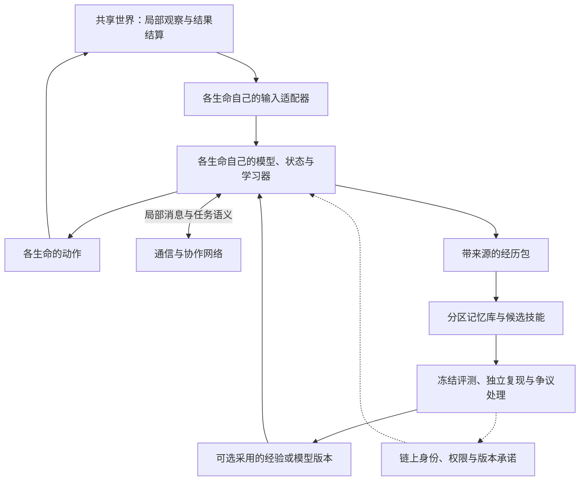

**FlySwarm 群体智慧协议再评估与开放架构提案**

日期：2026-09-18。性质：研究评估与下一版建议，未采纳、未实现，不替代 PRODUCT-LATEST.md 或已发布协议。依据是本次读到的工作区源码、版本清单、实验文档及公开研究；本次没有重跑实验、核验主网状态或审计竞品实现。工作区存在大量并行修改，历史实验必须按其自身源码与数据指纹解释。

我的判断是：新的定位值得推进，但要把“以果蝇为起点的开放群体智慧基础设施”落到可验证的能力上。已有身份、版本、重放和经验晋升设计值得保留；下一版的主要投入应是个体可塑性、可用的感觉运动闭环、情境化记忆和异构协作。扩大生命数量、神经元数量或链上事件数量，本身都不能完成这次升级。

建议现阶段对外表述：

> FlySwarm 是以果蝇连接组为起点，面向多生命、跨物种模型协作的开放群体智慧协议，致力于让数字生命学习、交流并传承可验证的经验。

“全球首个”暂不作为事实使用。本次检索已发现 [SWARM 的项目页面](https://www.swarm.family/) 使用链上生物神经网络种群叙事，并声明使用 MaleCNS；页面抓取时又标注合约未部署等状态。本次仅确认相关叙事已存在，不确认其实现、上线时间或科学有效性，也不能据此判定它已经实现与本提案完全相同的能力。要证明更窄范围的首创，需要预先定义比较条件、建立带日期的公开能力证据。相比抢占最长的修饰词，首次公开可独立复现的跨生命学习增益更有价值。

“通用”应指模型、任务、通信与验证接口可扩展，不能等同于通用人工智能。“跨物种”应指不同生物物种来源的模型能在明确任务中交换和利用信息；果蝇幼虫与成虫、雄蝇与雌蝇属于阶段或性别差异，不足以单独证明跨物种。“数字生命”是产品与研究对象名称，连接组模拟不等于复活被扫描动物，也没有恢复那只动物原有记忆的证据。

**现有基础的优点与实际进度需要一起保留。**

现有设计区分 LifeInstance、Runner、ComputeNode，保留独立生命状态；学习版本不进 Soul 身份核；观察、建议、结果和验证相互分开；T0–T4 试图排除算力增加、简单广播和训练集过拟合。这些是新方向所需的基础，不必整体重写。来源：[群体智慧协议设计稿](SWARM-INTELLIGENCE-PROTOCOL-DESIGN-2026-09-17.md)。

但设计稿的“实验未运行”以及部分图规模说明已落后于后续工作，不能只据该稿评价今天的系统：

| 本次可见证据 | 支持的判断 | 尚不支持的判断 |
| --- | --- | --- |
| 工作区 circuit 清单为 12,000 节点、477,021 条边；full 清单为 161,839 节点、2,749,558 条边 | 已有不同规模的项目筛选图 | 筛选边等于全部生物突触；历史 1,400 节点结果已验证新图 |
| protocol replay smoke 四臂全部采集 0，但有输入和行为变化 | 中继、去重、重放与输入因果链已有集成证据 | 任务增益、学习或真实 MaleCNS 群体能力 |
| 原中继诊断中四方位坐标都变为同一 food=346 | 标量适配器丢失瞬时方位信息 | 所有标量反馈都不可能导航 |
| 9 月 18 日校准控制器实验 dual 48/64、scalar 2/64；移除/打乱消息均为 0 | 某些固定几何中正确消息有用 | 64 个独立泛化样本或完整 T3 胜出 |
| 上述 dual 实际是 8 个几何成功 6 个，每个重复 8 个行为相同种子 | 存在有限的正面闭环证据，同时存在方向/几何失败 | 学习、长期记忆、真实多脑自治协作 |

来源：[图清单](../public/data/malecns-circuit/manifest.json)、[full 清单](../public/data/malecns-full/manifest.json)、[重放烟测](PROTOCOL-REPLAY-SMOKE-V1.md)、[中继诊断](RELAY-DIAGNOSIS-V1.md)、[消息消融](MOTOR-ABLATION-V1.md)。上述统计是对已保存材料的审阅，不是本次重新执行的结果。固定观察者只是实验观察角色，不能自动算作另一个神经生命。

**科学依据能支持具体机制，不能直接替项目完成证明。**

| 研究 | 能支持什么设计方向 | 不能据此宣称什么 |
| --- | --- | --- |
| Shiu 等，Nature 2024：连接组与递质信息驱动的 LIF 模型预测摄食、梳理相关感觉运动转换 | 用测量到的神经结构约束模型，并提出可检验预测 | 一份连接图天然具备学习、全部行为或智慧；另一数据集与本项目映射已验证。见[原论文](https://www.nature.com/articles/s41586-024-07763-9) |
| Lappalainen 等，Nature 2024：连接组约束且按任务优化的视觉网络 | 固定解剖约束，同时估计未知动力学参数是可研究路线 | 连接数量就是已测得的生理有效权重。见[原论文](https://www.nature.com/articles/s41586-024-07939-3) |
| Huang 等，Nature 2024：多巴胺介导短期与长期记忆单元的相互作用 | 分时标、分模块、受调制的可塑性和记忆消退 | 全脑统一加减权重即可复刻果蝇学习。见[原论文](https://www.nature.com/articles/s41586-024-07819-w) |
| Ramdya 等，Nature 2015：果蝇机械感觉接触参与群体避味行为 | 局部感知、触碰级联和集体行为可以有直接果蝇依据 | 广播消息等于真实触觉回路；级联反应等于长期学习。见[原论文](https://www.nature.com/articles/nature14024) |
| Kacsoh 等，PLOS Genetics 2018：部分果蝇物种共同生活后改善威胁信息交流 | 物种间交流需要学习或校准，不能只靠统一格式 | 任意物种通用语言或直接共享神经记忆。实验主要以雌蝇产卵反应评估，不能直接归到本项目雄蝇运行器。见[原论文](https://journals.plos.org/plosgenetics/article?id=10.1371/journal.pgen.1007430) |
| Bonnet 等，Science Robotics 2019：机器人连接蜜蜂与斑马鱼群体 | 不同感觉与行动体系可经明确中介实现跨物种信息交换 | 本项目已有相同能力，或机器人翻译不算额外计算。见[原论文](https://doi.org/10.1126/scirobotics.aau7897) |
| NeuroMechFly v2，Nature Methods 2024 | 把身体、视觉、嗅觉、反馈和地形纳入感觉运动研究 | 只接上仿真身体就自动完成生物验证。见[原论文](https://www.nature.com/articles/s41592-024-02497-y) |

因此，项目可以同时包含三种明确标注的组件：生物数据约束的神经模型、借鉴生物机制的工程算法、协议与链上基础设施。科学归因应落到具体组件与实验，不能把工程适配器完成的规划归因给果蝇神经网络。

**当前最需要补的是以下七个缺口。**

1. **个体学习过于粗糙。** `learn.mjs` 只有 food/threat/light 三个感觉增益。实际更新分支只增加 food 或 threat，每次 +1、上限 200，没有降低、遗忘、情境关联或明确的延迟信用分配；反馈只来自已实现 SELL 盈亏。它可以被准确称为产品层增益适应，但无法独自承载“可积累经验”的全部含义。更新次数也不能直接作为学会了多少的分数。来源：[学习实现](../src/brain/learn.mjs)。
2. **记忆尚未定义为可利用的内容。** 经历哈希、日志和检查点是基础设施。还需要说明接收者检索什么、如何判断适用、通过何种学习机制转化成自己的行为，以及记忆错误后如何修正。
3. **感觉运动接口仍主导成绩。** 原标量中继丢失方向；校准路由改善了一部分任务，又存在几何敏感。若外部适配器已计算方向误差并选择感觉源，就必须对照“同一适配器 + 简单控制器”，否则不能识别神经结构到底贡献了什么。
4. **多样性不能靠不同 seed 保证。** 0/1000 输入使若干实验中不同 RNG 不改变行为；同时相同祖先、相同观察、同一模型更新会造成错误相关。全网立刻同步“最佳经验”可能放大坏判断。人类估计任务已有社会影响降低多样性而不提高准确性的实验，这里只用作工程风险启发，不作为果蝇规律。见[Lorenz 等，PNAS 2011](https://pmc.ncbi.nlm.nih.gov/articles/PMC3107299/)。
5. **通用性仍有硬编码。** schemas 与 quorum 多处要求 `male-cns:v1.0`；神经输入通道与运动读出也有专属语义。需要新版本能力协商与物种配置，不能只在旧对象加一个 species 字符串。来源：[schemas](../src/brain/flyswarm/schemas.mjs)、[quorum](../src/brain/flyswarm/quorum.mjs)。
6. **连接组与生理模型需要分别版本化。** 当前递质规则将若干类型置为静默，runtime 没有因此自动具备多巴胺调制。增加神经元数量不会自动补上可塑性机制；应记录注释覆盖、删边阈值、递质规则、感觉注入和运动读出。来源：[provenance](../public/data/malecns-circuit/provenance.json)、[runtime](../src/brain/runtime.mjs)。
7. **生命能量、任务回报和经济资源不能混用。** 当前 runtime 在 `signal.food > 500` 时增加身体 energy。如果未来把远程食物消息、能量、存活与奖励相连，就可能仅凭闻到或听说食物获得能量。现有任务采集由独立位置结算，不能据此说已经发生奖励漏洞；新世界模型应让实际摄取事件决定能量补给，让通信只改变感知。来源：[runtime](../src/brain/runtime.mjs)、[任务结算](../src/brain/task.mjs)。

**建议在现有五接口上补齐三个不同速度的闭环。**

快速闭环负责个体感觉、神经动力学和行动；协作闭环负责局部信息、分工与经验交换；慢速闭环负责冻结候选、检验、复现与发布。行为不等待每次上链，也不等待全网投票。链上保留身份、授权、版本承诺、贡献结算与争议记录，计算和大部分原始记忆在链外运行与保存。

原 Task / Message / Learn / Pool / Identity 五接口继续成立。以下是其内部需要补的对象职责，不是要求现在冻结一整套新 schema：

| 对象 | 最低职责 |
| --- | --- |
| LifeProfile / ModelManifest | 物种分类、阶段、性别、数据与许可、动力学、身体、感觉和动作接口、学习规则、精度与重放等级、兼容任务 |
| TaskManifest | 世界版本、目标、局部观察权限、奖励与能量结算、时间语义、训练和评测预算、禁止泄漏的数据 |
| Message envelope | 来源与接收会话、任务与环境、语义版本、坐标/单位/时标、过期时间、观察或推断类型、证据引用 |
| Experience package | 经历片段、上下文、反馈、来源链、适用条件、训练用途、依赖版本与撤销记录 |
| Skill candidate | 更新的是神经参数、外部策略还是适配器；基础版本、学习预算、适用模型、恢复点、评测结果 |
| Evidence record | 执行可复现性、任务增益、生物证据、运营独立性分别记录，不折成一个“智慧认证”徽章 |

公共消息优先表达“观测到什么”，例如某种气味、位置、置信范围和来源。`food`、`danger` 等价值判断由接收者结合自己的身体与目标解释，同一种物质对不同生命的意义可能不同。无法解释的语义应拒绝或降级；物种适配器不得从评测器偷取最优动作。`receive → input` 的每一步都可审计。

时间也需要适配：各模型的积分步长可以不同，在任务规定的通信边界交换事件，记录观察时刻和传输延迟。不能把各物种一个 tick 强行当成相同生理时长。确定性参考运行器保留逐位重放；外部浮点或实物系统可采用容差与统计复现，证据等级必须不同，不能把确定性作为对全部生物模型的入场硬门槛。

**个体学习建议采用两条清楚标注的路线。**

第一条近期路线沿用 overlay 扩展点，做有上下文的关联学习：把任务回报改为真实摄取/损伤事件，加入学习痕迹、衰减、反转学习与固定回放；训练后冻结参数，再在未见刺激或场景评测。其名称仍是“工程学习器”，不包装成生物突触机制。先做最小气味—结果关联任务，可以把学习问题与复杂导航问题分开。

第二条研究路线是连接组约束的局部可塑性模型。优先研究有明确依据的蘑菇体输入、Kenyon cells、MBON 与调制神经元；先核查当前子图是否覆盖必要细胞和连接，再选择结构约束和学习规则。候选有效连接可以写成 `W_effective = W_reference + ΔW_instance`：原始数据制品保持不变，个体增量进入新模型配置及检查点。ΔW 的允许位置、符号、范围与更新机制都需明确。电镜接触数不能直接等同于已测量生理强度。

这是新的模型实验版本，不是原 `iff-runtime/1` 或旧创世包的静默修改。多巴胺调制可参考三因素/资格迹形式，但具体公式只是待验证假设，不是已完整确定的果蝇学习定律。完整恢复需包含可塑性参数、痕迹、调制状态、RNG、通信队列和世界状态。

两条路线都必须能回答：训练是否改变特定行为？关掉更新后还保留吗？清空学习状态后效果消失吗？奖励关系反转后能否修正？若只能单向增强而不能纠错，就不足以支撑开放环境的经验积累。

**共享记忆建议分成四种，采用方式各不相同。**

| 记忆 | 例子 | 共享与验证方式 |
| --- | --- | --- |
| 短暂线索 | 附近刚发现资源或威胁 | 局部传播、快速过期，测响应改善及误报成本 |
| 情节经验 | 某生命在某环境做了什么，结果如何 | 保存事件与来源，可供回放训练；下载不等于学会 |
| 情境知识 | 特定世界条件下某类线索预测危险 | 多次验证、记录适用边界和反例，环境变化后衰减 |
| 技能或模型更新 | 一个已评测的避险策略/可塑性快照 | 同模型检查兼容后可选择采用；异构模型须再学习与独立验收 |

跨物种默认交换经历、任务示例与可检验预测，不复制神经元权重。源物种的策略可以成为接收者训练课程的一部分，但接收者是否学会必须独立测量；蒸馏、映射和训练的算力也要记账。翻译器如果能学习，它自己也需要版本、训练数据和消融对照。

群体记忆不需要全员存全量。按任务、地点、时效和能力分区索引；有效期短的线索可用带衰减的环境痕迹帮助协调，这属于借鉴迹化协作的工程机制，不声称是果蝇天然蚁群信息素。历史事实追加保留，当前信任和适用性可以下降。错误知识应能被质疑、撤销，并追踪依赖它的候选技能。

群体可以拥有多个并存策略：探索型、保守型、快速响应型等。按具体任务成绩和资源代价选择，避免晋升机制只留下一个全局冠军。消息来源重复转发不能算多个独立证据；更换钱包和进程也不能制造独立复现。

**电影中的群体感，可以转化成几个真实可见的行为。**

一只先察觉；邻居作出反应；信号沿网络传播；部分成员继续探索，部分验证，部分利用发现；原发现者离开后，留下的经验仍能帮助新成员。这样既有波浪般的集体反应，也能展示记忆如何延续。无需把所有生命接到一个无限广播的中央意识。

这里需要分别测试反应级联、协同分工、持久记忆和传承。整齐转向可能只来自同一外部刺激；角色分配也可能是开发者写死的。因此演示中的连线、记忆点和角色变化应来自实际事件，允许用户切换“关闭通信”“清空共享记忆”“撤掉发现者”观看对照。保留不同意见和局部探索，比全体永远同步更符合我们想验证的群体能力。

**开放扩展需要允许不同实现，也要让能力边界可见。**

1. 将果蝇专属定义收进 Drosophila profile。保留历史 MaleCNS 身份与记录，新公共协议通过新版本支持其他 profile；不用重部署 Soul 身份核解决每一次扩展。
2. 一个物种允许多个有来源的模型谱系、实验室版本和动力学假设。母版是某个版本的起点，不能成为某物种唯一“正确大脑”；官方母体不拥有自动正确的记忆或复现特权。
3. 身份、模型血缘、训练来源与生物繁衍分别记账。复制检查点与采用经验不产生亲子关系；机器人和普通 AI agent 的 substrate 类型也不能伪装成真实生物物种。
4. 提供无钱包、离线可运行的参考实现与复算包，以及独立 runner 和存储后端接口。研究者能够不经过官方服务复现，才有实际开放性。
5. 神经模型互操作可评估 [NeuroML](https://neuroml.org/)；多智能体任务可提供 [PettingZoo](https://pettingzoo.farama.org/) 包装器。它们分别提供模型描述生态与任务 API，不能替代语义对齐，也不保证任意模型自动转换或逐位重放。
6. 下一物种可以评估 [OpenWorm](https://openworm.org/) 相关线虫模型，但应先验证其可运行版本、身体接口和任务能力。它是候选接入来源，不是现成可直接替换的果蝇脑。

接入验收分三步：能够运行并恢复；能够在明确语义下通信；通信或学习在接收端带来可测效果。只通过第一步的插件也可以开放使用，但不能宣传为已实现跨物种智慧迁移。

**链上部分应服务于可追溯性与协作结算。**

建议将身份与控制权、模型/任务/经验工件根、发布与撤销事件、服务贡献结算放在链上。神经步进、原始轨迹、大部分消息、训练和经验检索留在链外，按实验轮次或检查点批量提交承诺。数据可用性需要副本、保留期和恢复责任；一个哈希不能让已丢失的记忆回来。

哈希能检查内容与承诺的一致性；可重放包能检验计算；留出评测能支持限定任务上的增益；独立运营方复现能增加可信度。它们都不能由另外一种证据自动替代。未来零知识计算证明也只证明执行符合某程序与输入，并不能单独证明输入真实、评测公平或智慧成立。

全网地理扩展采用局部群体和跨群体经验交换更现实。网络分区时允许各群体继续在已授权范围内运行，恢复后按因果来源合并事实、保留冲突；无需每个神经步进都等待全球共识。链上的全局顺序与生命局部感知顺序需要清楚区分。

计算服务费、验证服务费、任务改进奖励与资金权限分别处理。质押、持币、神经元数量、存活时长和发消息次数不决定科学判断的正确性。诚实复现出“无效”也有服务价值；奖励不能只付给报告正面增益的人。贡献金额应受任务预算约束，不能把一份重复经验转发一千次变成一千份科学贡献。

**验收应围绕可证伪的问题推进。**

| 顺序 | 要回答的问题 | 最小设计与通过依据 |
| --- | --- | --- |
| 0 | 当前结果到底属于哪个模型？ | 将历史图、源码、输入与依赖打包；区分 1,400/12,000/full；第三方可从干净环境恢复 |
| 1 | 感觉信息能否变成可靠行为？ | 冻结感觉运动方案，跨位置、朝向、延迟、干扰评测；有同输入预算的简单控制器对照 |
| 2 | 单个生命是否真的学习？ | 关联/反转任务，训练后冻结；对照无学习、清空状态、打乱反馈；包含旧任务回归 |
| 3 | 多个生命是否有协作增益？ | 复用 T0–T4；增加有竞争力的广播与简单多智能体策略；全部参与者有独立状态、合法局部观察 |
| 4 | 共享记忆是否真的被利用？ | 用训练域经验库，冻结测试；比较正确记忆、空库、同量打乱/无关记忆；屏蔽测试答案泄漏 |
| 5 | 经验能否跨个体延续？ | 移除发现者；进一步替换所有有经验成员，让新成员仅从归档再学习；与无档案的新成员配对比较 |
| 6 | 能否在变化中纠错？ | 资源移位、奖励反转、注入误报、延迟与丢包、局部分区；测恢复速度、坏记忆传播与回滚 |
| 7 | 真正跨物种是否有用？ | 第二生物物种 profile 接入；比较无迁移、有迁移、错误迁移；接收者在留出条件下获益且计入翻译训练成本 |

统计单位按实际独立产生的环境、初态和训练重复定义。旋转、复制种子和重放都不自动增加有效样本数；分层或配对分析处理相关性。样本量由试点方差与预定最小有意义差异决定，不以固定“100 次”代替功效分析。预先冻结主要指标、失败容忍线、比较方法与测试条件；反复调参用独立开发集，不反复窥看同一留出集。

每个实验报告成绩与成本的曲线，至少包含任务收益、失败或伤害、通信量、神经更新/边访问、墙钟与硬件、训练与适配器计算。只按 tick 相同不能称等算力。生物连接图的贡献另做保留合理度数/权重/细胞类型约束的扰动对照，以及适配器/简单网络对照，避免使用过弱随机图制造优势；多次随机化并计入选择成本。

建议北极星观测为：**在固定任务与总预算下，新成员采用已有群体经验后，相对从零开始节省多少学习成本，同时维持任务成绩与失败率。** 用达到相同门槛所需交互量、迁移收益及旧能力保持率表示，不把不同任务强行相加成“总智商”。失败或负迁移同样公开。

**产品上应先交付一个能亲眼验证的世界。**

按本次新定位，交易世界应成为协议的一个应用插件；最早证明核心能力的场景宜选觅食、危险与信息分布不均的共享世界。它更容易控制反馈和观察权限，也更容易展示经验延续。首批用户可以观察、照料自己的生命、查看它贡献的经验，再由开发者与研究者提供新任务、模型和复核。真实生物混合系统可作为远期研究接入类型，当前不应宣称已有。

对用户可见的核心事件建议是：“我的生命发现了一条线索 → 其他生命验证并利用 → 经历被保存 → 新成员从中学会 → 我能看到关闭记忆后的差异。”研究者需要可下载实验和成本账单；模型开发者需要接入 SDK 与兼容测试。公共数据本身不是独占壁垒，持续积累的高质量复现、任务课程、可迁移经验与第三方实现才可能形成价值。

近期投入按通过门槛推进，不承诺未经资源评估的工期：先整理版本与复算包，并解决一个可重复的行为/学习任务；随后做少量独立生命的局部协作和记忆消融；通过后再扩大托管网络；最后接入第二物种并测迁移。界面与叙事可以同步演进，但展示的每种能力都应链接到对应版本的实验结果。

最终希望交付的能力可以表达为：**一个生命得到的经验，能够在它离开后，经验证、被其他生命重新学会，并在新的情境里继续发挥作用。** 这比神经元总数或整齐的集群动画，更直接地回答了本次产品升级要实现什么。
